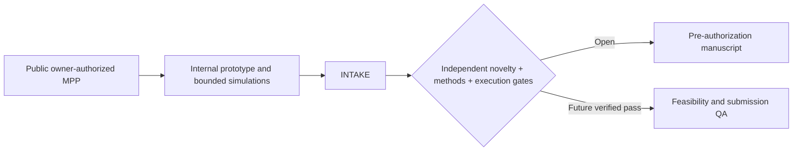

# KEYSTONE MPP v1.0

**Frozen title:** *KEYSTONE: Auditable Dispute-Key Availability for Encrypted AI Rollups*

This package is an evidence-gated minimum publishable prototype (MPP) for a narrow research claim:

> An encrypted rollup can obtain non-revealing, probabilistic evidence that a threshold decryption service is currently ready to serve an authorized dispute before a deadline, while keeping production records encrypted before authorization.

KEYSTONE is **not** presented as a new threshold-encryption, VSS, PVSS, proactive-secret-sharing, or TEE primitive. Its contribution is the formal separation of ciphertext availability from dispute-time decryption capability, an auditable canary partial-decryption protocol, explicit probability bounds, correlation-aware evaluation, and deadline-accountability interfaces.

Repository owner, draft-research attribution, and public-release authority:
**Zubaer Mahmood Zubraj** ([`@zmzubraj`](https://github.com/zmzubraj)).
The owner authorized this repository to remain publicly accessible on
30 August 2026. The MIT licence applies as recorded in [`LICENSE`](LICENSE);
third-party material retains its original terms.

## Package map

- `FREEZE.md` — frozen research decisions and change-control rules.
- `MASTER_GUIDE_BN.md` — complete Bangla research-to-MVP guide.
- `VERIFICATION.md` — executed tests, experiment results, environment, and caveats.
- `PACKAGE_MANIFEST.md` — complete archive inventory and entry points.
- `README_BN.md` — Bangla executive guide and quick-start.
- `WORKSPACE.md` — reproducible local workspace setup and verification commands.
- `RESEARCH_INTAKE.md` — canonical six-field research-program intake.
- `research-case/` — schema-v4 evidence, claim, provenance, review, and submission spine.
- `docs/` — complete research, protocol, algorithm, role, TDD, evaluation, and paper guidance.
- `prototype/` — runnable Python cryptographic core, simulator, tests, datasets, and figures.
- `contracts/` — Solidity bulletin-board skeleton for epoch, audit, dispute, and response evidence.
- `diagrams/` — editable Graphviz/Mermaid sources plus rendered PNG/SVG figures.
- `paper/` — paper outline, claims, theorem roadmap, BibTeX, and deterministic
  preliminary Markdown/LaTeX tables generated from canonical results.

## Quick start

```bash
make setup
make verify
make reproduce
```

`make setup` uses the checked-in `prototype/uv.lock` and Python 3.13. See
`WORKSPACE.md` for the fast and full verification paths.

Expected verification:

- 35 Python tests pass.
- End-to-end threshold KEM/DEM demo opens an encrypted inference receipt with threshold-valid partial decryptions.
- The frozen `n=32, t=22, s=8, q=8` static catastrophic-state bound reports false accept `0.01934628219389065`, or detection `0.9806537178061093`.
- Monte Carlo datasets with raw counts and 95% Wilson intervals, an exact
  stratified-validation dataset, and five paper-oriented figures are regenerated.
- Versioned canonical request/response bytes and transcript hashes reproduce
  `paper/test_vectors.json` exactly.
- Ed25519 signatures over the exact canonical partial-response bytes reproduce
  `paper/signature_test_vectors.json` and reject tampered or cross-context replay.

## Research status

Canonical status is fail-closed:

- current phase: `INTAKE`;
- novelty: `UNRESOLVED`;
- solution viability: `ASSERTED_ONLY`;
- acceptance readiness: `NOT_ASSESSABLE`; and
- manuscript: `DRAFT / PRE-MANUSCRIPT / PRE-AUTHORIZATION`.

Public hosting is authorized, but no arXiv, workshop, journal, or other
submission is authorized by this README. Independent novelty closure, methods
verification, execution authority, external evidence, final author metadata and
declarations, and accountable submission approval remain open.



## Safety and cryptographic status

The prototype uses a generated 256-bit safe-prime subgroup, deterministic hash-to-group canaries, Feldman commitments, Fiat–Shamir Chaum–Pedersen/DLEQ proofs, Shamir sharing, a threshold DH KEM, and AES-GCM. It is deliberately compact and reproducible. It has not undergone cryptographic audit and must not protect production funds or sensitive data.

## Verification status

The Python cryptographic/simulation artifact and all 35 tests were reproduced
successfully on macOS/Apple Silicon on 2026-08-29. The Solidity source compiles
with Solc 0.8.24; 19 unit, fuzz, gas, and stateful-invariant tests pass. Eight
dedicated operation-level Foundry gas snapshots and a generated CSV report are
checked in. Distributed-network measurements, formal-proof completion, and an
independent cryptographic audit remain pending. The Ed25519 adapter is test and
interoperability scaffolding, not production key management. See `VERIFICATION.md` for exact
evidence and `docs/19_MPP_TO_PUBLISHABLE_PAPER_PLAN_BN.md` for the active plan.
